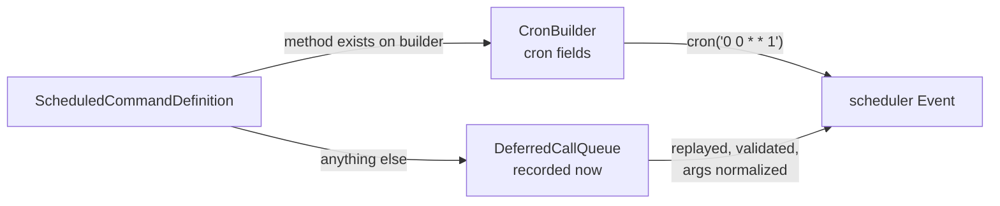

# Configuration

`laranail/package-tools` is a runtime base library. It publishes **no
`config/*.php` of its own** — a consuming package does not configure
`package-tools` through a config file or `vendor:publish`. Instead, the
consumer extends the abstract `PackageServiceProvider` and describes its
own package fluently inside `configurePackage(Package $package)`.

```php
use Simtabi\Laranail\Package\Tools\Package;
use Simtabi\Laranail\Package\Tools\PackageServiceProvider;

final class FooServiceProvider extends PackageServiceProvider
{
    public function configurePackage(Package $package): void
    {
        $package
            ->name('vendor/foo')
            ->hasConfigFile()
            ->hasViews()
            ->hasMigration('create_foos_table')
            ->hasInstallCommand(fn ($cmd) => $cmd->publishConfigFile()->askToRunMigrations())
            ->discoversWithAttributes()
            ->hasDoctorCheck(MyHealthCheck::class);
    }
}
```

The provider does the rest: it instantiates the `Package`, resolves the
package base path from the provider file location (`setPathFrom`), calls
`configurePackage()`, validates that a name and base path are set, loads
helpers, merges configs, then boots assets, views, routes, commands,
migrations, components, translations and the lifecycle hooks.

## The `Package` builder

Every fluent method returns `static`, so calls chain. The aggregator
traits live under `src/Concerns/Package/`; the methods below are the
public surface a consumer calls. Names and signatures are exact.

### Identity & paths

| Method | Purpose |
|---|---|
| `name(string $name, ?callable $transformer = null)` | Set the package name. **Vendor/package format is required** (e.g. `vendor/foo`); the vendor segment becomes `configVendor` and drives the config namespace. An optional transformer rewrites the short name. |
| `setName(...)` | Alias of `name()`. |
| `setPathFrom(string\|object $source, ?int $levelsUp = null)` | Set the package base path from a path string, a provider object (`$this`), or a class name. `levelsUp` defaults to 3 (provider in `src/Providers/`). The provider calls this automatically; override only for unusual layouts. |
| `setPublishTagId(string $id)` / `buildPublishTag(string $name, string $separator = '::')` | Set the base publish-tag id and build namespaced publish tags (`laranail::config`). Allowed separators: `::`, `:`, `-`. |

`buildPublishTag()` needs a base tag and there is **no shipped default**: set one
via `setPublishTagId('…')` on the package, or provide a
`laranail.package.publishing_tag_name` config value. Without either, it throws a
`RuntimeException`.

### Config

| Method | Purpose |
|---|---|
| `hasConfigFile(string\|array\|null $configFileName = null)` | Register one or more **flat** config files (`config/foo.php` → `config('foo.*')`). |
| `hasNestedConfig(string $fileName, string $folder = '', ?string $key = null)` | Mount a config file in a sub-folder at a folder-derived dotted key (`config/admin/panel.php` → `config('admin.panel.*')`). |
| `hasNestedConfigs(array $files, string $folder = '')` | Mount several files from the same sub-folder. |
| `registerNamespacedConfig(string $path, string $key, string $relative)` / `registerNamespacedConfigs(array $configs)` | Lower-level: register one config file (or a batch of `[path, key, relative]` entries) at an explicit dotted key + relative publish path. |
| `hasConfigDirectory(string $folder)` | Mount every file directly in a sub-folder (one level). |
| `discoversConfig(string $namespace = '', string $folder = '')` | Recursively mount the whole config tree by folder path (optional root namespace). |
| `loadConfigData(string $folder = '', bool $recursive = true)` | Read-and-**return** nested config as `[dottedKey => array]` without registering it (the counterpart of `discoversConfig()`). |
| `mergeConfigInto(string $sourceKey, string $targetKey, bool $deep = true)` | Merge one config key into another. |
| `mergeConfigGlobal(string $path, string $globalKey)` / `mergeConfigsGlobal(array $configs)` | Merge package config into a host (global) config key. |
| `setConfig(string $key, mixed $value)` / `setConfigs(array $values)` / `forgetConfig(string $key)` | Imperative config writes. |
| `enableConfigSafeMode()` / `disableConfigSafeMode()` | Toggle safe-mode merging. |
| `loadAllResources(array $resources = [])` | Convenience: auto-load several resource types at once (`configs`, `views`, `translations`, `migrations`, …) from their conventional package directories. Pass a subset to limit which are loaded. |

Beyond flat files, config files in sub-folders resolve to dotted keys
(`config('admin.panel.*')`) and a file may optionally declare its own mount with
an `__namespace` key — see **[Namespaced & nested config](tools/config-namespacing.md)**
for the folder→key mapping, precedence, publishing and merge semantics.

The four namespace getters (`getDottedNamespace()`, `getDashedNamespace()`,
`getDoubleColonNamespace()`, `getSlashNamespace()`) are memoized. Call
`warmNamespaceCache()` from `register()` to pre-compute them all up front, and
`clearNamespaceCache()` after changing the package name or vendor.

### Views, components & assets

| Method | Purpose |
|---|---|
| `hasViews(?string $namespace = null)` | Register the package view namespace. |
| `hasViewComposer(string\|array $view, Closure\|string $viewComposer)` | Bind a view composer. |
| `registerViewComposer(string\|array $views, string\|callable $composer, bool $autoPrefix = true)` | Bind a composer (now accepts a `string` class **or** `callable`); view names are auto-prefixed with the package namespace unless disabled. |
| `registerViewComposers(array $composers, bool $autoPrefix = true)` | Bind many composers from a `[views => composer]` map. |
| `registerGlobalViewComposer(string\|callable $composer)` | Bind a composer that fires for **all** views (via `'*'`, unprefixed). |
| `registerViewCreator(string\|array $views, string\|callable $creator, bool $autoPrefix = true)` | Bind a view *creator* (fires earlier than a composer). |
| `registerViewComposerWithDependencies(string\|array $views, string $composer, array $dependencies = [])` | Bind a composer whose constructor dependencies are resolved from the container. |
| `sharesDataWithAllViews(string\|array $name, mixed $value = null)` | Share a value with every package view — pass a `name`/`value` pair, or a `[name => value]` array to share several at once. |
| `hasViewComponent(string $prefix, string $viewComponentName)` / `hasViewComponents(string $prefix, string ...$names)` | Register class-based Blade components. |
| `hasAnonymousComponents(string $path, ?string $prefix = null)` / `discoverAnonymousComponents(string $baseDir = 'resources/views/components')` | Register or auto-discover anonymous Blade components. |
| `hasComponentNamespace(string $namespace, ?string $prefix = null)` / `hasComponentNamespaces(array $namespaces)` | Register Blade component namespaces via the `ComponentNamespaceResolver` (prefix auto-derived when `null`). **Now actually applied at boot** — pre-2.0 this was write-only. |
| `hasBladeComponentNamespace(string $classNamespace, string $prefix)` | Register a class namespace for `<x-prefix::component>` tag resolution (`Blade::componentNamespace()`). |
| `hasBladeComponentAlias(string $alias, string $componentClass)` / `hasBladeComponentAliases(array $aliases)` | Register one exact component alias (`Blade::component()` semantics), or a `[alias => class]` batch. |
| `hasBladeDirective(string $name, Closure $handler)` / `hasBladeDirectives(array\|Closure $directives)` | Register Blade directives. |
| `hasInertiaComponents(?string $namespace = null)` | Register Inertia components. |
| `hasLivewireComponent(string $name, string $class)` / `hasLivewireComponents(array\|Closure $components, ?string $whenConfig = null, bool $whenConfigDefault = true)` | Register Livewire components, optionally behind a package-level config gate. See [Livewire](#livewire) below. |
| `withoutLivewireNamespacePrefix()` | Register Livewire component names exactly as given instead of prefixing with the view namespace. |
| `hasVueComponent(string $name, string $path)` / `hasVueComponents(array $components)` / `hasVueComponentsDirectory(string $directory, ?string $namespace = null)` | Register Vue components. |
| `hasAssets()` | Register the package assets directory for publishing. |
| `publishAssets(string $source, string $destination, bool $cleanBeforePublish = false, ?string $tag = null)` | Register a source → destination asset publish path. |
| `publishFile(string $source, string $destination, ?string $suffix = null, bool $clean = false)` | Publish a single file under the package's namespaced tag `vendor::package-{suffix}` (suffix defaults to the source filename without extension). |
| `publishDirectory(string $source, string $destination, ?string $suffix = null, bool $clean = false)` | Publish a directory under the package's namespaced tag `vendor::package-{suffix}` (suffix defaults to the source directory basename). |
| `publishAssetGroup(string $groupName, array $assets, bool $cleanBeforePublish = false)` / `publishAssetGroups(array $groups, ...)` | Publish named asset groups. |
| `publishModuleJs(bool $clean = false)` / `publishModuleCss(...)` / `publishModuleMedia(...)` / `publishModuleVendors(...)` / `publishAllModuleAssets(...)` | Typed conveniences over `publishModuleAssets()` for the standard asset types. |
| `declareAssetGroup(string $name, array $config = [])` / `declareAssetGroups(array $groups)` | Declaratively register a named group resolved to `[source, target]` (source defaults to `public/{name}`, target to `vendor/{kebab}/{name}`); the provider publishes declared groups at boot. |
| `declareStandardAssetGroups()` | Declare the standard `js`, `css`, `images`, `fonts` groups. |
| `declareCustomAssetGroup(string $name, string $source, string $target)` | Declare a group with explicit source/target paths. |
| `getDeclaredAssetGroups()` | Return the declared asset groups (`[name => [source, target]]`). |

#### Blade component namespaces & aliases

Two registration funnels exist, and since 2.0 both are applied at boot
through `Blade::componentNamespace()` in the same step:

- `hasComponentNamespace('modules/admin')` — resolver-backed: the
  namespace path is resolved to a full class namespace and the tag prefix
  is auto-derived when omitted. Pre-2.0 this method **stored but never
  applied** its entries (write-only); 2.0 fixes that, so long-standing
  calls now take effect.
- `hasBladeComponentNamespace('Acme\\Hello\\View\\Components', 'hello')` —
  literal: exactly the class namespace and prefix you pass, no resolver.

For a single component that prefix loading cannot express, register an
exact alias — `Blade::component()` semantics:

```php
$package
    ->hasBladeComponentNamespace('Acme\\Hello\\View\\Components', 'hello') // <x-hello::button>
    ->hasBladeComponentAlias('hello-button', \Acme\Hello\View\Components\Button::class)
    ->hasBladeComponentAliases([
        'hello-card'  => \Acme\Hello\View\Components\Card::class,
        'hello-badge' => \Acme\Hello\View\Components\Badge::class,
    ]);
```

#### Livewire

`hasLivewireComponents()` accepts a `[name => class]` map (or a closure
returning one) plus an optional **package-level** config gate: when
`$whenConfig` is given, the whole set registers only if
`config($whenConfig, $whenConfigDefault)` is truthy at boot. The gate is
package-level and *last wins* — a later `hasLivewireComponents()` call
with a gate replaces an earlier gate.

```php
$package->hasLivewireComponents(
    ['greeting-board' => \Acme\Hello\Livewire\GreetingBoard::class],
    whenConfig: 'hello.livewire.enabled',
);
```

Component names are prefixed with the package view namespace
(`hello::greeting-board`) unless the name already contains `::` or the
package called `withoutLivewireNamespacePrefix()` — the opt-out is
required for dot-form names like `vendor-package.component`.

Registration is **reactive**: if the `livewire` container binding already
exists the components register immediately; otherwise they register via
`afterResolving('livewire')` the moment Livewire's provider binds it —
however late (covers `dont-discover` setups). If Livewire is never bound
(or the class does not exist), the whole step is a correct no-op.

### Routes, translations, middleware & events

| Method | Purpose |
|---|---|
| `hasRoute(string $routeFileName)` / `hasRoutes(string\|array ...$routeFileNames)` | Register route files. |
| `hasRoutesWhen(string $configKey, string\|array $routeFileNames, bool $default = false)` | Register route files loaded only when `config($configKey, $default)` is truthy at boot. See [Conditional routes](#conditional-routes). |
| `hasTranslations()` | Register the package translations directory. |
| `registerRouteMiddleware(string $name, string $class)` / `registerRouteMiddlewares(array $aliases)` | Register one route-middleware alias, or a `[alias => class]` batch. |
| `registerGlobalMiddleware(string $class)` | Register a global middleware (pushed onto the HTTP kernel at boot). |
| `registerMiddlewareAlias(string $alias, string $class)` / `registerMiddlewareAliases(array $aliases)` | Equivalents of `registerRouteMiddleware(s)` — same deferred registry. |
| `registerMiddlewareGroup(string $group, array $middleware)` / `registerMiddlewareGroups(array $groups)` | Register one middleware group, or batch-register a `[group => [middleware...]]` map. |
| `addToMiddlewareGroup(string $group, string $middleware)` / `registerPrefixedMiddleware(array $middleware, ?string $prefix = null)` | Append to a group registered on this package; register a `[alias => class]` map with an alias prefix (defaults to the package short name). |
| `registerEventListener(string $event, string $listener)` / `registerEventSubscriber(string $subscriber)` | Register event listeners and subscribers. |
| `registerEventListeners(array $listeners)` / `registerEventSubscribers(array $subscribers)` | Register many at once (`$listeners` accepts `[event => listener]` or `[event => [l1, l2]]`). |
| `discoverEventListeners(string $directory = 'src/Listeners', string $namespace = '')` | Auto-discover listeners in a directory; each event is inferred from the typed first parameter of the listener's `handle()` / `__invoke()`. |

#### <a name="conditional-routes"></a>Conditional routes

`hasRoutesWhen()` gates route files on a config value, evaluated **at
boot** (not at configure time). The default is `false`, so a conditional
route file is opt-in unless you say otherwise:

```php
$package
    ->hasRoute('web')                                  // always loaded
    ->hasRoutesWhen('hello.api.enabled', 'api')        // loaded only when truthy
    ->hasRoutesWhen('hello.admin.enabled', ['admin', 'admin-api'], default: true);
```

Files are named exactly like `hasRoute()` names them: relative to the
package `routes/` directory, without the `.php` extension.

#### Middleware: one deferred lifecycle

Since 2.0 **every** middleware method — the core
`registerRouteMiddleware(s)` / `registerGlobalMiddleware` and the
"enhanced" vocabulary (`registerMiddlewareAlias(es)`,
`registerMiddlewareGroup(s)`, `addToMiddlewareGroup`,
`registerPrefixedMiddleware`) — stores on the package and is applied in
**one boot step**, `bootPackageMiddleware(Router $router)`:

1. every alias via `$router->aliasMiddleware()`,
2. every group via `$router->middlewareGroup()`,
3. every global middleware via the HTTP kernel's `pushMiddleware()`.

The pre-2.0 eager path — where the enhanced methods wrote to the router
at configure time — is gone, so aliases, groups and global middleware all
follow the same lifecycle and ordering regardless of which method
registered them. `registerRouteMiddlewares()` is the batch form of the
core alias registration; `registerMiddlewareAlias(es)` are literal
equivalents kept for vocabulary symmetry.

### Authorization

`HasPolicies` gives the package Laravel's own `$policies` vocabulary,
applied through `Gate::policy()` in the deferred boot hooks:

| Method | Purpose |
|---|---|
| `registerPolicy(string $model, string $policy)` | Map one model to its policy. |
| `registerPolicies(array $policies)` | Batch form: `[Model::class => Policy::class]`. |
| `getPolicies()` | Return the registered map. |

```php
$package->registerPolicies([
    \Acme\Hello\Models\Greeting::class => \Acme\Hello\Policies\GreetingPolicy::class,
]);
```

### Morph maps

`HasMorphMaps` registers Eloquent morph aliases declaratively and
**non-enforcingly**: the package never calls
`Relation::requireMorphMap()` — a package forcing enforcement globally
would break unrelated host morphs, so hosts opt in themselves. All
registered entries are merged and applied in a single
`Relation::morphMap()` call, and morph maps boot **first** among the
deferred hooks because models may be touched by any later step.

| Method | Purpose |
|---|---|
| `registerMorphMap(array\|Closure $map)` | Static `alias => model` entries, or a closure returning them, evaluated lazily at boot. |
| `registerMorphMapFromConfig(string $mapConfigKey, ?string $userModelConfigKey = null, ?string $userAlias = 'user')` | Build the map from host config at boot. |

```php
$package
    // static entries, or lazy via closure
    ->registerMorphMap(['greeting' => \Acme\Hello\Models\Greeting::class])
    ->registerMorphMap(fn (): array => ['card' => \Acme\Hello\Models\Card::class])
    // host-defined entries from config
    ->registerMorphMapFromConfig('hello.morph_map');
```

`registerMorphMapFromConfig()` semantics, precisely:

- `$mapConfigKey` holds host-defined `alias => class` entries. It is
  **explicit and required** — there is no namespace-derivation magic that
  invents aliases for you.
- When `$userAlias` is non-`null` (default `'user'`), the user model is
  also mapped under that alias, resolved from
  `config($userModelConfigKey)` when given, falling back to
  `config('auth.providers.users.model')`. Pass `userAlias: null` to skip
  the user entry entirely.
- Every entry (config-derived or static) is validated: the alias must be
  a string and the class an `Illuminate\Database\Eloquent\Model`
  subclass; anything else is silently dropped.
- Config-derived entries are applied before the static
  `registerMorphMap()` entries, so an explicit static entry wins over a
  config one for the same alias.

### Observers

`HasObservers` maps models to observers, applied via
`$model::observe($observer)` in the deferred boot hooks:

| Method | Purpose |
|---|---|
| `registerObserver(string $model, string\|array $observers)` | One model, one or several observers. |
| `registerObservers(array $observers)` | Batch form: `[Model::class => Observer::class]` or `[Model::class => [Observer1::class, Observer2::class]]`. |
| `getObservers()` | Return the registered map. |

```php
$package->registerObservers([
    \Acme\Hello\Models\Greeting::class => \Acme\Hello\Observers\GreetingObserver::class,
]);
```

### Rate limiters

`HasRateLimiters` registers named limiters through `RateLimiter::for()`
at boot. Limiter closures run **per request**, so config reads inside
them are already lazy — no extra gating sugar is needed:

| Method | Purpose |
|---|---|
| `registerRateLimiter(string $name, Closure $limiter)` | Register one named limiter. |
| `registerRateLimiters(array $limiters)` | Batch form: `[name => Closure]`. |
| `getRateLimiters()` | Return the registered map. |

```php
use Illuminate\Cache\RateLimiting\Limit;
use Illuminate\Http\Request;

$package->registerRateLimiter(
    'hello-api',
    fn (Request $request): Limit => Limit::perMinute(
        (int) config('hello.api.rate_limit', 60),
    )->by($request->user()?->id ?? $request->ip()),
);
```

### Database

| Method | Purpose |
|---|---|
| `hasMigration(string $migrationFileName)` / `hasMigrations(string\|array ...$names)` | Register migration files. |
| `runsMigrations(bool $runsMigrations = true)` | Auto-run package migrations. |
| `discoversMigrations(bool $discoversMigrations = true, string $path = '/database/migrations')` | Auto-discover migrations from a path. |
| `loadFactoriesFrom(string $path)` / `loadSeedersFrom(string $path)` | Load factories / seeders from a path. |
| `registerSeeder(string $seederClass)` | Register a single seeder. |
| `hasPackageSeeders(AutoSeederDefinition\|string $key, array $seeders = [])` / `discoverPackageSeedersIn(string $path, ?string $namespace = null)` | Register or discover per-package seeders for `db:seed`-time execution. See [Package seeders](#package-seeders) below. |

#### Package seeders

`hasPackageSeeders()` registers a bundle of `Illuminate\Database\Seeder`
classes for **`db:seed`-time execution**. Seeders NEVER run at package
boot: boot only evaluates each definition's config gate and registers
the surviving bundles with the shared `SeederManager`; execution happens
when the host app's `Database\Seeders\DatabaseSeeder` resolves
(typically `php artisan db:seed` with no `--class`). The pre-2.0
boot-time-immediate path was removed.

The simple shape is a key plus an explicit class list (execution order =
array order); for full control pass a fluent `AutoSeederDefinition`
(`Support\Definitions\AutoSeederDefinition`):

```php
use Simtabi\Laranail\Package\Tools\Support\Definitions\AutoSeederDefinition;

// shorthand: key + explicit list
$package->hasPackageSeeders('acme/hello', [
    \Acme\Hello\Database\Seeders\HelloSeeder::class,
]);

// full control: discovery, ignore list, config gate, priority
$package->hasPackageSeeders(
    AutoSeederDefinition::make('acme/hello')
        ->discoverIn(__DIR__ . '/../database/seeders')
        ->ignoreSeeders([\Acme\Hello\Database\Seeders\LegacySeeder::class])
        ->inNamespace('Acme\\Hello\\Database\\Seeders')
        ->whenConfig('hello.seed.enabled')
        ->priority(10),
);
```

`discoverPackageSeedersIn(string $path, ?string $namespace = null)` is
sugar over the definition's discovery mode: it tokenises the `*.php`
files under `$path` (no autoloader needed) and registers the `Seeder`
subclasses it finds.

The definition surface, gates, per-bundle typed options
(`SeederBundle`), priority ordering across packages, and the standalone
`PackageSeeder` facade / `SeederManager` path are all documented in
**[Seeding](seeding.md)** — you do **not** need the `Package` builder to
use seeding.

### Commands

| Method | Purpose |
|---|---|
| `hasCommand(string $commandClassName)` / `hasCommands(string\|array ...$names)` | Register Artisan commands. |
| `hasConsoleCommand(string $commandClassName)` / `hasConsoleCommands(...)` | Register console-only commands. |
| `hasInstallCommand(callable $callable)` | Register an interactive install command (e.g. `->publishConfigFile()->askToRunMigrations()`). |
| `autoLoadCommands(?string $dir = null)` | Auto-discover `Illuminate\Console\Command` subclasses under `src/Commands` (override `$dir`) and register each via `hasCommands()`. No-ops if the directory is missing or the package namespace can't be resolved. |

The closure passed to `hasInstallCommand()` receives the install command
and can chain these steps (`src/Commands/Concerns/`):
`publishConfigFile()`, `publishAssets()`, `publishMigrations()`,
`askToRunMigrations()`, `askToStarRepoOnGitHub(string $vendorSlashRepo, bool $defaultAnswer = false)`,
`copyAndRegisterServiceProviderInApp()`, `startWith(callable)`, and
`endWith(callable)`.

### Scheduled commands

`HasScheduledCommands` schedules package commands declaratively. The
provider applies the definitions once the `Schedule` resolves (console
only, after every provider has booted) via
`callAfterResolving(Schedule::class, …)` — config gates and cadences
evaluate **then**, never earlier.

| Method | Purpose |
|---|---|
| `registerScheduledCommand(ScheduledCommandDefinition\|string $command, Cadence\|CronExpressible\|string\|Closure $cadence = Cadence::Daily)` | Register one command — a full definition, or a command string plus cadence. |
| `registerScheduledCommands(array $commands)` | Batch form: definitions, plain command strings, or `[$command => $cadence]` pairs. |
| `schedulesUsing(Closure $callback)` | Raw escape hatch: the closure receives the `Schedule` itself. |

#### The two-tier definition

`ScheduledCommandDefinition`
(`Support\Definitions\ScheduledCommandDefinition`) is one fluent surface
composed from two collaborators, and its dispatch rule is simple: a
method that exists on the embedded `CronBuilder` forwards there (tier 1,
cron fields); **any other** call is recorded in a `DeferredCallQueue`
and replayed on the real `Illuminate\Console\Scheduling\Event` at
schedule time (tier 2, runtime constraints and execution modifiers) —
so the full Laravel scheduler vocabulary works fluently without being
reimplemented. Replay is validated: a call that exists on neither
surface throws an `InvalidArgumentException` when the schedule is built.



At replay, arguments are normalized so typed values flow through magic
dispatch uniformly: a `BackedEnum` becomes its value, a `TimeOfDay`
becomes its `format24()` string, and a `CronExpressible` becomes its
`toExpression()` string. That is what makes the enums below usable
directly:

```php
use Simtabi\Laranail\Package\Tools\Enums\Environment;
use Simtabi\Laranail\Package\Tools\Enums\Timezone;
use Simtabi\Laranail\Package\Tools\Enums\Weekday;
use Simtabi\Laranail\Package\Tools\Support\Definitions\ScheduledCommandDefinition;
use Simtabi\Laranail\Package\Tools\Support\Scheduling\TimeOfDay;

$package->registerScheduledCommand(
    ScheduledCommandDefinition::make('hello:digest')
        // tier 1 — cron fields, handled by the embedded CronBuilder
        ->weekly(Weekday::Monday)
        ->at(TimeOfDay::pm(5, 30))                     // 17:30
        // tier 2 — Event modifiers, deferred and replayed at schedule time
        ->timezone(Timezone::AfricaNairobi)
        ->environments(Environment::Production, Environment::Staging)
        ->withoutOverlapping()
        ->onOneServer()
        ->runInBackground()
        // gate: evaluated at schedule time
        ->whenConfig('hello.digest.enabled'),
);
```

A **bare definition** (no frequency, no deferred calls) schedules
`daily()` — never every-minute.

#### Cadences: `cadence()`, `cron()`, `cadenceFromConfig()`

The `Enums\Cadence` string enum has a typed case for every standard
scheduler frequency — from `Cadence::EverySecond` through
`Cadence::EveryFiveMinutes`, `Cadence::Hourly`, `Cadence::Daily`,
`Cadence::Weekdays`, `Cadence::Weekly`, `Cadence::Monthly`,
`Cadence::Quarterly`, `Cadence::Yearly`. Case values are the scheduler
`Event` method names, so the dispatch pipeline consumes them directly.

`cadence(Cadence|CronExpressible|string|Closure $cadence)` accepts:

- a `Cadence` case — `->cadence(Cadence::Hourly)`;
- a `CronExpressible` (e.g. a prepared `CronBuilder`) — seeds the
  embedded builder with its expression;
- a string, resolved through one pipeline: a known `Cadence` value
  (`'daily'`), then a raw 5-field cron expression (`'0 2 * * *'`), then a
  `'method[:comma,args]'` scheduler-method string (`'dailyAt:02:00'`,
  `'twiceDaily:1,13'`) routed through the same cron-first/event-fallback
  dispatch as fluent calls (numeric args are cast, since scheduler
  methods take ints and config gives strings);
- a `Closure` — recorded and replayed with the `Event` as its argument.

`cron(CronExpressible|string $expression)` seeds the builder with a full
expression directly.

`cadenceFromConfig(string $key, Cadence|CronExpressible|string|null $default = null)`
reads the cadence from host config **at schedule time**:

| Config state | Result |
|---|---|
| Key missing | Falls back to `$default`. |
| Value (or fallback) is a non-empty string | Applied through the same pipeline as `cadence()` — enum value, raw cron, or `'method:args'`. |
| Value is explicitly `null` or `false` — or the key is missing **and** `$default` is `null` | The command is **not scheduled at all** (null opts out). |
| Anything else (malformed) | Not scheduled — fail closed, never guess. |

```php
$package->registerScheduledCommand(
    ScheduledCommandDefinition::make('hello:prune')
        ->cadenceFromConfig('hello.prune.cadence', Cadence::Daily),
);
// config('hello.prune.cadence') can be 'hourly', '0 3 * * *',
// 'dailyAt:03:30' — or null to disable the schedule entirely.
```

#### Gates: `whenConfig()` vs `whenConfigNotNull()`

Both use the shared `Support\ConfigGate`, and both evaluate when the
schedule is built — never at configure time:

- `whenConfig(string $key, bool $default = true)` — **truthy mode**: the
  command schedules iff `(bool) config($key, $default)` is `true`. A
  missing key uses `$default` (default `true`, i.e. opt-out).
- `whenConfigNotNull(string $key)` — **not-null mode** ("configured
  means on"): the command schedules iff `config($key) !== null`. There
  is no default; a missing key reads as `null` and skips. `false`, `0`
  or `''` all pass — only `null` opts out.

A later gate call replaces the earlier one — a definition holds one
gate.

#### Escape hatches

`configure(Closure $callback)` records a closure into the same deferred
queue; at schedule time it receives the real `Event`, after the cron
expression has been applied and in chain order with the other deferred
calls. For access to the whole `Schedule` (jobs, closures, `exec`),
use `schedulesUsing()`:

```php
$package->schedulesUsing(function (\Illuminate\Console\Scheduling\Schedule $schedule): void {
    $schedule->job(new \Acme\Hello\Jobs\SyncGreetingsJob)->everyFifteenMinutes();
});
```

#### `CronBuilder` standalone

`Support\Scheduling\CronBuilder` is standalone by design — usable
anywhere a cron string is needed — and is the single implementation of
the cron-expressible frequency vocabulary (the definition delegates to
it rather than reimplementing it). It implements the
`Contracts\CronExpressible` contract: `toExpression()` returns a valid
5-field expression.

```php
use Simtabi\Laranail\Package\Tools\Enums\Weekday;
use Simtabi\Laranail\Package\Tools\Support\Scheduling\CronBuilder;

CronBuilder::make()->weekdays()->at('06:15')->toExpression();   // '15 6 * * 1-5'
CronBuilder::make()->everyMinutes(10)->toExpression();          // '*/10 * * * *'
CronBuilder::make()->monthly(15)->toExpression();               // '0 0 15 * *'
CronBuilder::make()->twiceWeekly(Weekday::Tuesday, Weekday::Friday)->toExpression();
CronBuilder::make()->fromExpression('0 2 * * 1-5')->toExpression(); // verbatim
```

Field setters (`minute()`, `hour()`, `dayOfMonth()`, `month()`,
`dayOfWeek()`) accept ints, validated strings (`'*/5'`, `'5-20'`,
`'1-30/2'`) or lists of either; `dayOfWeek()` also takes `Weekday`
cases. Every numeric atom is range-checked and invalid values throw an
`InvalidArgumentException`. A builder seeded with `fromExpression()`
returns that expression verbatim and rejects field setters afterwards —
one source of truth per builder. The builder holds cron **fields only**:
runtime constraints (`between`, `environments`, overlap control) belong
on the scheduler event, not in the expression.

> `biWeekly()` and `biMonthly()` are deliberately honest: they mean
> **twice a week** (`twiceWeekly()`) and **twice a month**
> (`twiceMonthly()`). A true "every two weeks" is not cron-expressible —
> cron has no week-step field.

The every-two-weeks recipe is a weekly expression plus a runtime
constraint on the event:

```php
ScheduledCommandDefinition::make('hello:fortnightly-report')
    ->weekly(Weekday::Monday)
    ->at('06:00')
    ->configure(fn ($event) => $event->when(
        fn (): bool => now()->weekOfYear % 2 === 0,
    ));
```

#### The scheduling enums

| Enum | Cases | Notes |
|---|---|---|
| `Enums\Cadence` | Every standard scheduler frequency (`everySecond` … `yearly`). | String-backed; values are `Event` method names. |
| `Enums\Weekday` | `Sunday = 0` … `Saturday = 6`. | Int-backed, cron/Laravel numbering — exactly where an enum prevents bugs. Calendar months stay plain ints (1-12 is unambiguous). |
| `Enums\Environment` | `Production`, `Staging`, `Local`, `Testing`. | Custom environment names remain legal — pass the raw string to `environments()`. |
| `Enums\Timezone` | Every IANA timezone identifier PHP knows, plus a `toDateTimeZone()` helper. | **Generated — never edit by hand.** |

The `Timezone` enum is deliberately not hand-maintained: it is generated
from PHP's own `DateTimeZone::listIdentifiers()` by
`tools/generate-timezone-enum.php`. After a PHP or tzdata upgrade,
regenerate it —

```bash
php tools/generate-timezone-enum.php
```

— rather than editing `src/Enums/Timezone.php`.

`Support\Scheduling\TimeOfDay` is the fluent time value both tiers
accept: `TimeOfDay::at(17, 30)`, `TimeOfDay::am(9)` / `TimeOfDay::pm(5, 30)`,
or `TimeOfDay::parse('5:30pm')` (also `'17:30'`, `'5:30 PM'`, `'5pm'`),
with minute-level arithmetic that wraps across midnight
(`plusMinutes()`, `minusMinutes()`, `plusHours()`) and a canonical
`format24()` (`'17:30'`) — what cron fields and scheduler methods
consume.

### Service providers & helpers

| Method | Purpose |
|---|---|
| `publishesServiceProvider(string $providerName)` | Publish a stub service provider into the host app. |
| `hasChildProviders(array $providers)` | Register child / feature service providers (eager or deferred) at register time. |
| `loadHelpers()` | Load the package `helpers/` directory. (The provider also auto-loads helpers when the directory exists.) |

### Extensions

| Method | Purpose |
|---|---|
| `discoversWithAttributes(?string $directory = null, ?string $namespace = null)` | Scan `src/` for classes carrying `#[AsArtisanCommand]`, `#[AsRoute]`, `#[AsViewComposer]` and wire them automatically. Defaults to the package `src/` and detected namespace. |
| `hasDoctorCheck(string\|DoctorCheck $check)` / `hasDoctorChecks(array $checks)` | Register one or many `DoctorCheck`s for `php artisan laranail::package-tools.doctor`. |
| `hasValidationRule(string $name, string $ruleClass, ?string $message = null)` / `hasValidationRules(array $rules)` | Register a custom validator rule (or a batch keyed by name, each value a `class-string` or `[class-string, message]`). |
| `hasAboutSection(string $label, callable $data)` / `hasAboutSections(array $sections)` | Add one or many `php artisan about` sections (label → callable returning a `[label => value]` array). |

## Lifecycle hooks

There are two ways to run code at well-defined points in the package
lifecycle.

### 1. Override hooks on the provider

`PackageServiceProvider` exposes five overridable methods. Laravel runs
*all* providers' register phase before *any* boot phase.

| Hook | Phase | Use for |
|---|---|---|
| `registeringPackage()` | Register (first) | Log channels, Horizon supervisors, morph maps, child providers — infrastructure that must exist before anything uses it. |
| `configurePackage(Package $package)` | Register | The package definition (name, paths, features). **Abstract — required.** |
| `packageRegistered()` | Register (after config merge) | Container singletons, bindings, aliases, facade backing classes. |
| `bootingPackage()` | Boot (before auto-boot) | Middleware, route-model bindings, Blade namespaces, gates/policies. |
| `packageBooted()` | Boot (last) | Event listeners, scheduler tasks, cross-package integrations, cache warming. |

Between `bootingPackage()` and `packageBooted()` the provider auto-boots
assets, Blade components and directives, commands, scheduled commands,
configs, Inertia, Livewire, migrations, routes, child providers,
translations, views, view composers, shared view data, custom publishes,
validation rules, about sections, the deferred Package hooks, and doctor
checks. The deferred Package hooks run in a fixed order: **morph maps
first** (models may be touched by any later step), then middleware, event
listeners, event subscribers, policies, observers, rate limiters,
factories, and finally auto-seeder **registration** (execution belongs to
`db:seed` — see [Seeding](seeding.md)).

### 2. Closure hooks on the `Package`

The `HasLifecycleHooks` trait
(`src/Concerns/Package/HasLifecycleHooks.php`) lets `configurePackage()`
register closures that receive the `Package` instance. Each returns
`static`, so they chain:

| Method | Fires |
|---|---|
| `onBeforeRegister(Closure $cb)` / `onAfterRegister(Closure $cb)` | Around package registration. |
| `onBeforeBoot(Closure $cb)` / `onAfterBoot(Closure $cb)` | Around package boot. |
| `onBeforeConfigLoad(Closure $cb)` / `onAfterConfigLoad(Closure $cb)` | Around config loading. |
| `onBeforeViewLoad(Closure $cb)` / `onAfterViewLoad(Closure $cb)` | Around view loading. |

```php
$package->onAfterBoot(function (Package $package) {
    Log::info('Booted package: ' . $package->name);
});
```

`getRegisteredHooks()` returns a per-hook count, primarily for tests.

## Runtime environment variables

`package-tools` reads **no** env vars for its own configuration. The
only env vars it consults are read by
`Simtabi\Laranail\Package\Tools\Services\Http\HttpConfigurationService`,
which is an opt-in fluent builder for HTTP-client option arrays. Defaults
are applied when the variable is unset or empty; every value can also be
set fluently in code (constructor args or setters), which overrides the
env default.

| Variable | Type | Default | Builder accessor |
|---|---|---|---|
| `PKG_HTTP_PERSIST_CONNECTION` | bool | `true` | `setPersistConnection()` / `isPersistConnection()` |
| `PKG_HTTP_REQUEST_TIMEOUT` | int (seconds, `>= 0`) | `60` | `setRequestTimeout()` / `getRequestTimeout()` |
| `PKG_HTTP_MAX_RETRIES` | int (`>= 0`) | `10` | `setMaxRetries()` / `getMaxRetries()` |
| `PKG_HTTP_CACHE_TTL` | int (seconds, `>= 0`) | `10` | `setCacheTtl()` / `getCacheTtl()` |
| `PKG_HTTP_BASE_URI` | string | `null` | `setBaseUri()` / `getBaseUri()` |
| `PKG_HTTP_PROXY` | string | `null` | `setProxy()` / `getProxy()` |

`toGuzzleConfig()` returns an array keyed compatibly with both Guzzle and
Laravel's `Http::withOptions()`. The builder pulls in no HTTP client of
its own. Details and a usage example are in
[tools/runtime-services.md](tools/runtime-services.md).

## Worked example

[`examples/`](https://github.com/laranail/package-tools/tree/main/examples) is a cohesive `Acme\Hello` package that exercises
every package-tools feature end to end. Start with the provider, which ties
the rest together:

- [HelloPackageServiceProvider.php](https://github.com/laranail/package-tools/blob/main/examples/HelloPackageServiceProvider.php)
  — the fluent builder (config, views, components, translations, assets,
  routes plain and config-gated, migrations, commands), scheduled commands
  with the enums and gates, policies, a config-driven morph map, an
  observer, a rate limiter, gated Livewire components, the install-command
  flow, `db:seed`-time package seeders, attribute discovery, two doctor
  checks, and both override and closure lifecycle hooks.
- [Console/HelloCommand.php](https://github.com/laranail/package-tools/blob/main/examples/Console/HelloCommand.php) — a command
  registered via `hasCommand()`.
- [Database/Seeders/GreetingSeeder.php](https://github.com/laranail/package-tools/blob/main/examples/Database/Seeders/GreetingSeeder.php)
  — a seeder run through `hasPackageSeeders()`, with the
  `SeedingStarted`/`SeedingFinished` events noted inline.
- [Doctor/HelloHealthCheck.php](https://github.com/laranail/package-tools/blob/main/examples/Doctor/HelloHealthCheck.php) — the
  `DoctorCheck` wired via `hasDoctorCheck()`.

## See also

- [tools/attribute-discovery.md](tools/attribute-discovery.md) —
  `discoversWithAttributes()` in depth.
- [tools/doctor.md](tools/doctor.md) — the `DoctorCheck` contract behind
  `hasDoctorCheck()`.
- [architecture.md](architecture.md) — the aggregator-trait structure
  underneath the builder.

[← Docs index](../README.md#documentation)
