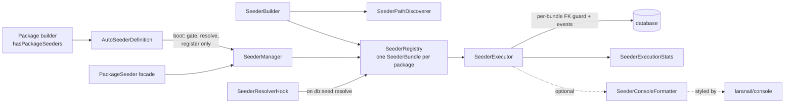

# Seeding

`laranail/package-tools` is the single home for laranail's database
seeding. It works **two ways**:

1. **Through the `Package` builder** — package authors register seeders
   on their package with `hasPackageSeeders()` (an
   `AutoSeederDefinition`); they run automatically on `db:seed`. See
   [Configuration → Package seeders](configuration.md#package-seeders).
2. **Standalone** — anyone can register/run seeders without the builder,
   via the `PackageSeeder` facade / `SeederManager`, or the fluent
   `SeederBuilder`.

Both paths share the same engine: `SeederRegistry` (what to run, as
typed per-package `SeederBundle`s), `SeederExecutor` (runs it, with FK
guard + events), `SeederPathDiscoverer` (tokeniser-based discovery, no
autoloader needed), and `SeederResolverHook` (auto-run on
`DatabaseSeeder` resolve).

## How it fits together



```
src/Services/Database/
├── SeederManager.php          entry point (autoSeed / seeders / run / registry)
├── SeederBuilder.php          fluent discovery + filtering + register/execute
├── SeederPathDiscoverer.php   tokeniser-based class discovery (no autoloader)
├── SeederRegistry.php         what to run (typed SeederBundle per package)
├── SeederBundle.php           one package's bundle: typed, isolated options
├── SeederExecutor.php         runs it (priority order, FK guard, events, stats)
├── SeederResolverHook.php     auto-run hook on DatabaseSeeder resolve
├── SeederConsoleFormatter.php tree-structured console output (optional)
└── Contracts/SeederConsoleFormatterInterface.php

src/Support/Definitions/
└── AutoSeederDefinition.php   the Package builder's seeder definition
```

## When seeders run

Package seeders **never execute at application boot**. The pre-2.0
boot-time-immediate path (seeders running inside `packageBooted()`) was
removed; there is now exactly one automatic execution point:

- **Boot** — the provider evaluates each definition's config gate,
  resolves its class list, and registers the surviving bundles with the
  shared `SeederManager`. Registration only.
- **`db:seed` time** — the `SeederResolverHook` runs everything
  registered the first time the host app's
  `Database\Seeders\DatabaseSeeder` resolves (typically `php artisan
  db:seed` without `--class`). The hook is idempotent — repeated
  `attach()` calls never stack listeners — and fires at most once per
  console invocation / request.

Outside that, execution is always explicit: `PackageSeeder::run()`,
`SeederBuilder::execute()`, or `SeederExecutor::run($registry)`.

## Through the `Package` builder: `AutoSeederDefinition`

`hasPackageSeeders(AutoSeederDefinition|string $key, array $seeders = [])`
takes either the string + array shorthand (execution order = array
order) or a fluent
`Simtabi\Laranail\Package\Tools\Support\Definitions\AutoSeederDefinition`
for full control:

```php
use Simtabi\Laranail\Package\Tools\Support\Definitions\AutoSeederDefinition;

$package->hasPackageSeeders(
    AutoSeederDefinition::make('acme/hello')
        ->seeders([                       // explicit, order-guaranteed list
            \Acme\Hello\Database\Seeders\RoleSeeder::class,
            \Acme\Hello\Database\Seeders\GreetingSeeder::class,
        ])
        ->ignoreSeeders([\Acme\Hello\Database\Seeders\LegacySeeder::class])
        ->inNamespace('Acme\\Hello\\Database\\Seeders')
        ->whenConfig('hello.seed.enabled') // gate, evaluated at boot
        ->priority(10),                    // lower runs first across packages
);
```

| Method | Purpose |
|---|---|
| `AutoSeederDefinition::make(string $key)` | Create a definition keyed by an opaque label (typically the package name). |
| `seeders(array $seeders = [])` | Explicit class list — execution order is the array order. Empty (or never called) switches the definition to **discovery mode**. |
| `discoverIn(string $path)` | Discovery-source override; without it, discovery falls back to the package's `database/seeders` directory at boot. |
| `ignoreSeeders(array $seeders)` | Exclusion list, applied to **both** explicit and discovered lists. |
| `inNamespace(?string $namespace)` | Group label used by events and console output. |
| `whenConfig(string $key, bool $default = true)` | Truthy config gate: the bundle registers only when `(bool) config($key, $default)` is `true` at boot. |
| `whenConfigNotNull(string $key)` | Not-null gate ("configured means on"): registers iff `config($key) !== null`. |
| `priority(int $priority)` | Cross-package ordering — lower runs first; ties keep registration order (the sort is stable). |
| `options(array $options)` | Legacy string-keyed `SeederRegistry` options passthrough. |

Explicit list vs discovery, precisely: when `seeders()` holds a
non-empty list, that list is used verbatim (in order); otherwise the
`SeederPathDiscoverer` tokenises the `*.php` files under `discoverIn()`'s
path — or, if none was given, the package's `database/seeders`
directory — and keeps the `Illuminate\Database\Seeder` subclasses it
finds. Either way the `ignoreSeeders()` list is then subtracted. An
empty result registers nothing, which is not an error.

`discoverPackageSeedersIn(string $path, ?string $namespace = null)` on
the `Package` is sugar over discovery mode:

```php
$package->discoverPackageSeedersIn(
    __DIR__ . '/../database/seeders',
    'Acme\\Hello\\Database\\Seeders',
);
```

## Bundles: typed, per-package options

The registry stores one `SeederBundle` per key — typed fields and fluent
setters instead of magic option-string keys. Options are **scoped to the
bundle**: one package's FK/event/parameter choices never leak into
another package's run.

```php
use Simtabi\Laranail\Package\Tools\Services\Database\SeederBundle;

$bundle = SeederBundle::make('acme/hello', [GreetingSeeder::class])
    ->inNamespace('Acme\\Hello\\Database\\Seeders')
    ->withoutForeignKeyChecks()      // default true
    ->firesEvents()                  // default false
    ->parameters(['count' => 25])    // ctor args for seeders that accept them
    ->priority(10);

app(\Simtabi\Laranail\Package\Tools\Services\Database\SeederRegistry::class)
    ->registerBundle($bundle);
```

| Setter | Default | Effect |
|---|---|---|
| `withoutForeignKeyChecks(bool $disable = true)` | `true` | Wrap **this bundle's** run in `ForeignKeyCheckGuard` (nesting-safe, exception-safe); other bundles run with their own setting. |
| `firesEvents(bool $fire = true)` | `false` | Emit the per-seeder events for this bundle (and the batch events when any bundle opts in). |
| `parameters(array $parameters)` | `[]` | Passed to the constructor of any seeder in this bundle that declares constructor arguments; parameterless seeders resolve via the container. |
| `priority(int $priority)` | `0` | Cross-bundle ordering — lower first, stable ties. |
| `inNamespace(?string $namespace)` | `null` | Group label (`'Default'` when unset). |

`SeederRegistry::register(string $key, array $seeders, ?string
$namespace = null, array $options = [])` keeps the historical
string-keyed shape (`disable_foreign_key_checks`, `fire_events`,
`parameters`, `priority`) and converts it to a bundle via
`SeederBundle::fromOptions()`; `registerBundle()` is the typed path.
Registering the same key again **replaces** that package's bundle.

### Priority ordering across packages

`SeederExecutor::run()` sorts the registered bundles by priority
ascending before executing — lower runs first, and the sort is stable,
so equal priorities keep registration order. Use it when one package's
seeders depend on another's data:

```php
// laranail/roles seeds first…
AutoSeederDefinition::make('laranail/roles')->seeders([RoleSeeder::class])->priority(0);
// …acme/hello depends on those roles
AutoSeederDefinition::make('acme/hello')->seeders([GreetingSeeder::class])->priority(10);
```

## Standalone: the `PackageSeeder` facade

This path is unchanged in 2.0 — `SeederManager::autoSeed()` keeps its
signature and still accepts the legacy options array:

```php
use Simtabi\Laranail\Package\Tools\Facades\PackageSeeder;

// Register a bundle to run automatically when `php artisan db:seed` runs:
PackageSeeder::autoSeed('Acme\\Blog', [
    \Acme\Blog\Database\Seeders\BlogSeeder::class,
], namespace: 'Acme\\Blog', options: ['fire_events' => true]);

// Or run something right now and inspect the typed result:
$stats = PackageSeeder::seeders()
    ->from(database_path('seeders'))
    ->only(['UserSeeder', 'RoleSeeder'])
    ->withoutForeignKeyChecks()
    ->execute();

echo $stats->getSummary(); // "2/2 seeders completed successfully in 12.30ms"
```

`SeederManager` (resolved via the facade or `app(SeederManager::class)`)
exposes `autoSeed()`, `seeders()` (a fresh `SeederBuilder`), `run()` (run
everything registered), and `registry()`.

## Fluent `SeederBuilder`

```php
use Simtabi\Laranail\Package\Tools\Services\Database\SeederBuilder;

$stats = app(SeederBuilder::class)
    ->from(database_path('seeders'))   // discover from path(s)
    ->classes([MySeeder::class])       // and/or explicit classes
    ->except(['LegacySeeder'])         // filter by FQCN or short name
    ->namespace('Acme\\Blog')
    ->fireEvents()
    ->execute();                       // returns SeederExecutionStats
```

`->discover()` returns the resolved, filtered, de-duplicated class list
without running. `->register()` registers into the shared registry (so the
seeders run on the next `DatabaseSeeder` resolve) instead of executing.

## Results: `SeederExecutionStats`

`execute()` / `SeederExecutor::run()` return a typed, immutable
`Simtabi\Laranail\Package\Tools\ValueObjects\SeederExecutionStats`:

| Member | Description |
|---|---|
| `total` / `success` / `failed` | Counts |
| `totalTime` | Milliseconds |
| `errors` | `list<array{class, message, package}>` |
| `isSuccessful()` / `hasFailures()` / `isEmpty()` | Predicates |
| `getSuccessRate()` | Percentage |
| `getFormattedTotalTime()` | e.g. `1.23s` / `456.78ms` |
| `getSummary()` | One-line human summary |
| `toArray()` / `jsonSerialize()` | Serialisation |

A seeder that throws is logged and counted as a failure without aborting
the rest of the run.

## Events

| Event | When | Payload |
|---|---|---|
| `Events\SeedingStarted` | before the batch (opt-in) | `packages` |
| `Events\SeedingFinished` | after the batch (opt-in) | `packages`, `successCount`, `failureCount` |
| `Events\SeederExecuting` | before each seeder | `seederClass`, `package` |
| `Events\SeederExecuted` | after each success | `seederClass`, `durationMs`, `package` |
| `Events\SeederFailed` | on each failure | `seederClass`, `exception`, `package` |

Events require the bundle's `firesEvents()` / `fire_events` option
(default off); the batch events fire once when **any** registered bundle
opts in, the per-seeder events only for the bundles that did.

## Console output

`SeederExecutor` accepts an optional
`Simtabi\Laranail\Package\Tools\Services\Database\Contracts\SeederConsoleFormatterInterface`.
Pass one (with an `OutputStyle` set) to get tree-structured, colourised
progress output, styled via the `ConsoleUIFormatter` from
[`laranail/console`](https://github.com/laranail/console) — a
required dependency of this package, so it is always available:

```php
use Simtabi\Laranail\Package\Tools\Services\Database\SeederConsoleFormatter;
use Simtabi\Laranail\Package\Tools\Services\Database\SeederExecutor;

$formatter = new SeederConsoleFormatter();
$formatter->setOutput($this->output); // in a command
$stats = (new SeederExecutor($app, null, $formatter))->run($registry);
```

Without a formatter the executor is silent (results come back as
`SeederExecutionStats`).

## Legacy options

The string-keyed options array (accepted by `SeederRegistry::register()`,
`SeederManager::autoSeed()`, and `AutoSeederDefinition::options()`) maps
onto the typed `SeederBundle` setters:

| Option | Type | Default | Typed equivalent |
|---|---|---|---|
| `disable_foreign_key_checks` | bool | `true` | `withoutForeignKeyChecks()` |
| `fire_events` | bool | `false` | `firesEvents()` |
| `parameters` | array | `[]` | `parameters()` |
| `priority` | int | `0` | `priority()` |

---

[← Docs index](../README.md#documentation)
