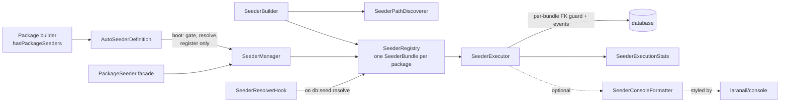

# Seeding

`laranail/package-tools` is the single home for laranail's database
seeding. It works **two ways**:

1. **Through the `Package` builder** — package authors register seeders
   on their package with `hasPackageSeeders()` (an
   `AutoSeederDefinition`); they run automatically on `db:seed`. See
   [Configuration → Package seeders](configuration.md#package-seeders).
2. **Standalone** — anyone can register/run seeders without the builder,
   via the `PackageSeeder` facade / `SeederManager`, or the fluent
   `SeederBuilder`.

Both paths share the same engine: `SeederRegistry` (what to run, as
typed per-package `SeederBundle`s), `SeederExecutor` (runs it, with FK
guard + events), `SeederPathDiscoverer` (tokeniser-based discovery, no
autoloader needed), and `SeederResolverHook` (auto-run on
`DatabaseSeeder` resolve).

## How it fits together



```
src/Services/Database/
├── SeederManager.php          entry point (autoSeed / seeders / run / registry)
├── SeederBuilder.php          fluent discovery + filtering + register/execute
├── SeederPathDiscoverer.php   tokeniser-based class discovery (no autoloader)
├── SeederRegistry.php         what to run (typed SeederBundle per package)
├── SeederBundle.php           one package's bundle: typed, isolated options
├── SeederExecutor.php         runs it (priority order, FK guard, events, stats)
├── SeederResolverHook.php     auto-run hook on DatabaseSeeder resolve
├── SeederConsoleFormatter.php tree-structured console output (optional)
└── Contracts/SeederConsoleFormatterInterface.php

src/Support/Definitions/
└── AutoSeederDefinition.php   the Package builder's seeder definition
```

## When seeders run

Package seeders **never execute at application boot**, and since 3.0
they never execute as a side effect of resolving an arbitrary seeder
either. The execution points are:

- **Boot** — the provider evaluates each definition's config gate,
  resolves its class list, and registers the surviving bundles with the
  shared `SeederManager`. Registration only.
- **`db:seed` time** — the `SeederResolverHook` runs every bundle not
  already executed this process when a **root seeder** resolves:
  `Database\Seeders\DatabaseSeeder` or any FQCN listed in
  `package-tools.seeders.root_seeders`. `db:seed --class=SomeSeeder`
  no longer triggers package bundles (the 2.x hook bound the abstract
  `Seeder` type, so ANY seeder resolution — including web requests and
  the executor's own `make()` calls — ran everything; that footgun is
  gone).
- **After `php artisan migrate`** — ONLY for bundles that opted in via
  `autorunAfterMigrations()` / `autorunNow()`. See
  [Autorun after migrations](#autorun-after-migrations).
- **On a schedule** — ONLY for bundles that declared a cadence. See
  [Scheduling seeders](#scheduling-seeders).
- **`php artisan laranail::package-tools.seed`** — the explicit command
  trigger (`--key=`, `--package=`, `--sync`, `--queued`, `--force`,
  `--status`).

Outside those, execution is always explicit: `PackageSeeder::run()`,
`SeederBuilder::execute()`, or `SeederExecutor::run($registry)`.

A shared per-process ledger keeps every trigger honest: a bundle that
already ran (autorun, manual, or db:seed) is skipped by the others, so
`migrate --seed` never double-runs. `PackageSeeder::resetRunState()` is
the escape hatch for multi-tenant loops.

**Boot is crash-safe.** Registration happens at boot, so a malformed
seeder source file (a parse or require failure surfacing from discovery)
could otherwise take down the host app on every request. Instead the
broken bundle is logged through the package's own
[`$package->log()`](tools/logging.md) and skipped — healthy bundles still
register, and the app boots.

## Autorun after migrations

Seeders never run on their own unless a bundle opts in:

```php
$package->hasPackageSeeders(
    AutoSeederDefinition::make('demo-data')
        ->seeders([CountrySeeder::class, CurrencySeeder::class])
        ->autorunAfterMigrations(),          // or the alias ->autorunNow()
);

$package->autorunSeeders(); // package-level: opt in every definition
```

The trigger is `Illuminate\Database\Events\MigrationsEnded` — fired once
per Migrator batch, including nested `$command->call('migrate')` (so an
install command's `runsMigrations()` step is covered automatically).
Rollbacks (`method === 'down'`) and `--pretend` runs never trigger. When
nothing is pending Laravel fires `NoPendingMigrations` instead, so
autorun stays quiet — add `runsSeeders()` to your install command for
the already-migrated case.

Safety gates, all of which must pass:

| Gate | Control |
|---|---|
| Global kill-switch | `package-tools.seeders.autorun.enabled` (default `true`) |
| Console only | never fires on web requests or queue workers |
| Unit tests | skipped unless `package-tools.seeders.autorun.in_tests` (default `false`) — `RefreshDatabase` never seeds by surprise |
| Production | skipped unless `package-tools.seeders.autorun.in_production` (default `false`) |
| Environment list | `autorunInEnvironments(Environment::Local, 'staging')` REPLACES the production gate for that bundle |
| Per-package veto | `{vendor}.{package}.seeders.autorun => false` host config |
| Once per process | the shared executed-key ledger |

Autorun failures never abort `migrate`: they are reported to the console
and the log, then swallowed. Write autorun seeders idempotently
(`updateOrCreate` / `firstOrCreate`) — `migrate:fresh` re-runs them by
design (there is deliberately no persisted "already seeded" marker).

## Background execution

Large bundles can run on the queue instead of blocking the console or
request:

```php
use Simtabi\Laranail\Package\Tools\Enums\QueueConnection;

$package->hasPackageSeeders(
    AutoSeederDefinition::make('demo-data')
        ->seeders([...])
        ->runsInBackground()                                      // alias ->queued()
        ->onQueue('seeding', connection: QueueConnection::Redis), // any BackedEnum|string
);
```

Every execution surface honors the flag: the seed command dispatches a
`RunSeederBundleJob` instead of running inline (`--sync` / `--queued`
override per invocation). The job payload carries **only the bundle key**
— the worker's own provider boot re-registers the bundle and the job
re-resolves it (a vanished key warns and no-ops). Queue name, connection,
tries, and timeout default from `package-tools.seeders.queue.*`.

Progress is observable from any process sharing the cache:

```
php artisan laranail::package-tools.seed --status
```

renders each bundle's tracked state (pending / processing / completed /
failed, processed counts, timestamps) via the cache-backed
`SeederRunTracker`.

`withoutOverlapping()` guards a bundle with a cache lock across ALL
execution paths (plus schedule-level `withoutOverlapping` for scheduled
runs), so two triggers can't seed the same bundle concurrently.

## Scheduling seeders

Bundles can recur on the scheduler — the cadence vocabulary is the same
one `registerScheduledCommand()` uses (enum cases, cron expressions,
scheduler-method strings, closures):

```php
use Simtabi\Laranail\Package\Tools\Enums\Cadence;
use Simtabi\Laranail\Package\Tools\Support\Scheduling\TimeOfDay;

$package->hasPackageSeeders(
    AutoSeederDefinition::make('nightly-sync')
        ->seeders([...])
        ->scheduledAt(TimeOfDay::at(2))   // sugar for cadence('dailyAt:02:00')
        ->withoutOverlapping(),
);

// or any cadence form:
AutoSeederDefinition::make('weekly')->cadence(Cadence::Weekly);
AutoSeederDefinition::make('custom')->cadence('0 */6 * * *');
```

Each cadenced bundle lands on the host schedule as
`laranail::package-tools.seed --key=X --scheduled` (visible in
`php artisan schedule:list`). The scheduler passes **no mode flag** —
the bundle's own `runsInBackground()` choice decides queued vs inline;
`--scheduled` only marks provenance in the events and tracker. The last
`scheduledAt()`/`cadence()` call wins (one cadence slot per bundle).

## Completion events & notifying users

The package never notifies users itself — it emits typed events and the
host decides who to tell and how (mail, Slack, database notification,
broadcast):

| Event | When | Payload |
|---|---|---|
| `PackageSeedingStarted` | bundle begins | `packageName`, `bundleKey`, `seederCount`, `SeederExecutionMode $mode` |
| `PackageSeedingCompleted` | bundle finishes (inspect stats for failures) | + `SeederExecutionStats $stats`, `durationMs` |
| `PackageSeedingFailed` | each seeder that throws | + `seederClass`, `exceptionClass`, `message` |

Events fire for **every** mode (inline included) by default. Suppress
per bundle with `notifiesOnCompletion(false)` or globally with
`package-tools.seeders.events.enabled => false`.

Host-app listener example:

```php
// AppServiceProvider::boot()
Event::listen(function (PackageSeedingCompleted $event): void {
    Notification::route('mail', config('ops.email'))->notify(
        new SeedingFinishedNotification($event->packageName, $event->stats->getSummary()),
    );
});
```

Built-in observability on top: each package's own seeding outcomes also
land in its [`$package->log()`](tools/logging.md) logfile with a
`Seeder` label (`success`/`warning`/`error` by outcome).

## Through the `Package` builder: `AutoSeederDefinition`

`hasPackageSeeders(AutoSeederDefinition|string $key, array $seeders = [])`
takes either the string + array shorthand (execution order = array
order) or a fluent
`Simtabi\Laranail\Package\Tools\Support\Definitions\AutoSeederDefinition`
for full control:

```php
use Simtabi\Laranail\Package\Tools\Support\Definitions\AutoSeederDefinition;

$package->hasPackageSeeders(
    AutoSeederDefinition::make('acme/hello')
        ->seeders([                       // explicit, order-guaranteed list
            \Acme\Hello\Database\Seeders\RoleSeeder::class,
            \Acme\Hello\Database\Seeders\GreetingSeeder::class,
        ])
        ->ignoreSeeders([\Acme\Hello\Database\Seeders\LegacySeeder::class])
        ->inNamespace('Acme\\Hello\\Database\\Seeders')
        ->whenConfig('hello.seed.enabled') // gate, evaluated at boot
        ->priority(10),                    // lower runs first across packages
);
```

| Method | Purpose |
|---|---|
| `AutoSeederDefinition::make(string $key)` | Create a definition keyed by an opaque label (typically the package name). |
| `seeders(array $seeders = [])` | Explicit class list — execution order is the array order. Empty (or never called) switches the definition to **discovery mode**. |
| `addSeeders(string ...$seeders)` | Append to the explicit list without replacing it; duplicates ignored. |
| `discoverIn(string $path, bool $recursive = false)` | Discovery-source override; without it, discovery falls back to the package's `database/seeders` directory at boot. `$recursive` descends into nested directories. |
| `ignoreSeeders(array $seeders)` | Exclusion list, applied to **both** explicit and discovered lists. |
| `inNamespace(?string $namespace)` | Group label used by events and console output. |
| `whenConfig(string $key, bool $default = true)` | Truthy config gate: the bundle registers only when `(bool) config($key, $default)` is `true` at boot. |
| `whenConfigNotNull(string $key)` | Not-null gate ("configured means on"): registers iff `config($key) !== null`. |
| `priority(int $priority)` | Cross-package ordering — lower runs first; ties keep registration order (the sort is stable). |
| `autorunAfterMigrations(bool $autorun = true)` / `autorunNow(...)` | Opt in to automatic execution after `php artisan migrate` (see [Autorun after migrations](#autorun-after-migrations)). |
| `autorunInEnvironments(Environment\|BackedEnum\|string ...$environments)` | Restrict autorun to these environments (replaces the production config gate for this bundle). |
| `stopOnFailure(bool $stop = true)` | Skip the bundle's remaining seeders after the first failure. |
| `runsInBackground(bool $background = true)` / `queued(...)` | Execute via a queued job (see [Background execution](#background-execution)). |
| `onQueue(BackedEnum\|string\|null $queue = null, BackedEnum\|string\|null $connection = null)` | Queue name/connection for background execution; implies `runsInBackground()`. |
| `scheduledAt(TimeOfDay\|string $time)` / `cadence(Cadence\|CronExpressible\|string\|Closure $cadence)` | Recurring execution (see [Scheduling seeders](#scheduling-seeders)); last call wins. |
| `withoutOverlapping(int $expiresAtMinutes = 1440)` | Cache-lock every execution path against concurrent runs. |
| `notifiesOnCompletion(bool $notify = true)` | Per-bundle opt-out for the `PackageSeeding*` events (default on). |
| `options(array $options)` | Legacy string-keyed `SeederRegistry` options passthrough. An explicit fluent `priority()` overrides an options `priority`; a never-set fluent priority no longer clobbers it. |

Explicit list vs discovery, precisely: when `seeders()` holds a
non-empty list, that list is used in order, de-duplicated (a seeder
listed twice runs once; the first occurrence keeps its position);
otherwise the
`SeederPathDiscoverer` tokenises the `*.php` files under `discoverIn()`'s
path — or, if none was given, the package's `database/seeders`
directory — and keeps the `Illuminate\Database\Seeder` subclasses it
finds. A discovery directory that does not exist yields nothing (not a
boot error). Either way the `ignoreSeeders()` list is then subtracted.
An empty result registers nothing, which is not an error.

`discoverPackageSeedersIn(string $path, ?string $namespace = null)` on
the `Package` is sugar over discovery mode:

```php
$package->discoverPackageSeedersIn(
    __DIR__ . '/../database/seeders',
    'Acme\\Hello\\Database\\Seeders',
);
```

## Bundles: typed, per-package options

The registry stores one `SeederBundle` per key — typed fields and fluent
setters instead of magic option-string keys. Options are **scoped to the
bundle**: one package's FK/event/parameter choices never leak into
another package's run.

```php
use Simtabi\Laranail\Package\Tools\Services\Database\SeederBundle;

$bundle = SeederBundle::make('acme/hello', [GreetingSeeder::class])
    ->inNamespace('Acme\\Hello\\Database\\Seeders')
    ->withoutForeignKeyChecks()      // default true
    ->firesEvents()                  // default false
    ->parameters(['count' => 25])    // ctor args for seeders that accept them
    ->priority(10);

app(\Simtabi\Laranail\Package\Tools\Services\Database\SeederRegistry::class)
    ->registerBundle($bundle);
```

| Setter | Default | Effect |
|---|---|---|
| `withoutForeignKeyChecks(bool $disable = true)` | `true` | Wrap **this bundle's** run in `ForeignKeyCheckGuard` (nesting-safe, exception-safe); other bundles run with their own setting. |
| `firesEvents(bool $fire = true)` | `false` | Emit the per-seeder events for this bundle (and the batch events when any bundle opts in). |
| `parameters(array $parameters)` | `[]` | Passed to the constructor of any seeder in this bundle that declares constructor arguments; parameterless seeders resolve via the container. |
| `priority(int $priority)` | `0` | Cross-bundle ordering — lower first, stable ties. |
| `inNamespace(?string $namespace)` | `null` | Group label (`'Default'` when unset). |

`SeederRegistry::register(string $key, array $seeders, ?string
$namespace = null, array $options = [])` keeps the historical
string-keyed shape (`disable_foreign_key_checks`, `fire_events`,
`parameters`, `priority`) and converts it to a bundle via
`SeederBundle::fromOptions()`; `registerBundle()` is the typed path.
Registering the same key again **replaces** that package's bundle.

### Priority ordering across packages

`SeederExecutor::run()` sorts the registered bundles by priority
ascending before executing — lower runs first, and the sort is stable,
so equal priorities keep registration order. Use it when one package's
seeders depend on another's data:

```php
// laranail/roles seeds first…
AutoSeederDefinition::make('laranail/roles')->seeders([RoleSeeder::class])->priority(0);
// …acme/hello depends on those roles
AutoSeederDefinition::make('acme/hello')->seeders([GreetingSeeder::class])->priority(10);
```

## Standalone: the `PackageSeeder` facade

This path is unchanged in 2.0 — `SeederManager::autoSeed()` keeps its
signature and still accepts the legacy options array:

```php
use Simtabi\Laranail\Package\Tools\Facades\PackageSeeder;

// Register a bundle to run automatically when `php artisan db:seed` runs:
PackageSeeder::autoSeed('Acme\\Blog', [
    \Acme\Blog\Database\Seeders\BlogSeeder::class,
], namespace: 'Acme\\Blog', options: ['fire_events' => true]);

// Or run something right now and inspect the typed result:
$stats = PackageSeeder::seeders()
    ->from(database_path('seeders'))
    ->only(['UserSeeder', 'RoleSeeder'])
    ->withoutForeignKeyChecks()
    ->execute();

echo $stats->getSummary(); // "2/2 seeders completed successfully in 12.30ms"
```

`SeederManager` (resolved via the facade or `app(SeederManager::class)`)
exposes `autoSeed()`, `seeders()` (a fresh `SeederBuilder`), `run()` (run
everything registered), and `registry()`.

## Fluent `SeederBuilder`

```php
use Simtabi\Laranail\Package\Tools\Services\Database\SeederBuilder;

$stats = app(SeederBuilder::class)
    ->from(database_path('seeders'))   // discover from path(s)
    ->classes([MySeeder::class])       // and/or explicit classes
    ->except(['LegacySeeder'])         // filter by FQCN or short name
    ->namespace('Acme\\Blog')
    ->fireEvents()
    ->execute();                       // returns SeederExecutionStats
```

`->discover()` returns the resolved, filtered, de-duplicated class list
without running. `->register()` registers into the shared registry (so the
seeders run on the next `DatabaseSeeder` resolve) instead of executing.

## Results: `SeederExecutionStats`

`execute()` / `SeederExecutor::run()` return a typed, immutable
`Simtabi\Laranail\Package\Tools\ValueObjects\SeederExecutionStats`:

| Member | Description |
|---|---|
| `total` / `success` / `failed` | Counts |
| `totalTime` | Milliseconds |
| `errors` | `list<array{class, message, package}>` |
| `isSuccessful()` / `hasFailures()` / `isEmpty()` | Predicates |
| `getSuccessRate()` | Percentage |
| `getFormattedTotalTime()` | e.g. `1.23s` / `456.78ms` |
| `getSummary()` | One-line human summary |
| `toArray()` / `jsonSerialize()` | Serialisation |

A seeder that throws is logged and counted as a failure without aborting
the rest of the run.

## Events

| Event | When | Payload |
|---|---|---|
| `Events\SeedingStarted` | before the batch (opt-in) | `packages` |
| `Events\SeedingFinished` | after the batch (opt-in) | `packages`, `successCount`, `failureCount` |
| `Events\SeederExecuting` | before each seeder | `seederClass`, `package` |
| `Events\SeederExecuted` | after each success | `seederClass`, `durationMs`, `package` |
| `Events\SeederFailed` | on each failure | `seederClass`, `exception`, `package` |

Events require the bundle's `firesEvents()` / `fire_events` option
(default off); the batch events fire once when **any** registered bundle
opts in, the per-seeder events only for the bundles that did.

## Console output

`SeederExecutor` accepts an optional
`Simtabi\Laranail\Package\Tools\Services\Database\Contracts\SeederConsoleFormatterInterface`.
Pass one (with an `OutputStyle` set) to get tree-structured, colourised
progress output, styled via the `ConsoleUIFormatter` from
[`laranail/console`](https://github.com/laranail/console) — a
required dependency of this package, so it is always available:

```php
use Simtabi\Laranail\Package\Tools\Services\Database\SeederConsoleFormatter;
use Simtabi\Laranail\Package\Tools\Services\Database\SeederExecutor;

$formatter = new SeederConsoleFormatter();
$formatter->setOutput($this->output); // in a command
$stats = (new SeederExecutor($app, null, $formatter))->run($registry);
```

Without a formatter the executor is silent (results come back as
`SeederExecutionStats`).

## Legacy options

The string-keyed options array (accepted by `SeederRegistry::register()`,
`SeederManager::autoSeed()`, and `AutoSeederDefinition::options()`) maps
onto the typed `SeederBundle` setters:

| Option | Type | Default | Typed equivalent |
|---|---|---|---|
| `disable_foreign_key_checks` | bool | `true` | `withoutForeignKeyChecks()` |
| `fire_events` | bool | `false` | `firesEvents()` |
| `parameters` | array | `[]` | `parameters()` |
| `priority` | int | `0` | `priority()` |

## Failure observability

The 8 bespoke seeder events (`PackageSeeding*`, `Seeder*`, `Seeding*`) are the seeder-specific detail layer and are unchanged. Since 4.0 the cross-type `PackageActionFailed` fires **alongside** them — and, crucially, on the autorun, `db:seed` resolver, and queued-job paths that previously swallowed failures. Subscribe once to `PackageActionFailed` for a cross-type view, or keep listening to `PackageSeedingFailed` for seeder detail. See [Action lifecycle events](tools/action-events.md).

---

[← Docs index](../README.md#documentation)
