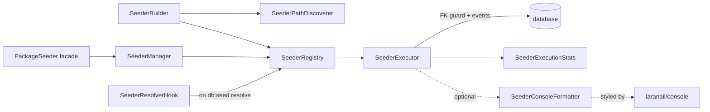

# Seeding

`laranail/package-tools` is the single home for laranail's database
seeding. It works **two ways**:

1. **Through the `Package` builder** — package authors register seeders
   on their package; they run automatically on `db:seed`. See
   [Configuration → Package seeders](configuration.md#package-seeders).
2. **Standalone** — anyone can register/run seeders without the builder,
   via the `PackageSeeder` facade / `SeederManager`, or the fluent
   `SeederBuilder`.

Both paths share the same engine: `SeederRegistry` (what to run),
`SeederExecutor` (runs it, with FK guard + events), `SeederPathDiscoverer`
(tokeniser-based discovery, no autoloader needed), and
`SeederResolverHook` (auto-run on `DatabaseSeeder` resolve).

## How it fits together



```
src/Services/Database/
├── SeederManager.php          entry point (autoSeed / seeders / run / registry)
├── SeederBuilder.php          fluent discovery + filtering + register/execute
├── SeederPathDiscoverer.php   tokeniser-based class discovery (no autoloader)
├── SeederRegistry.php         what to run
├── SeederExecutor.php         runs it (FK guard, events, stats)
├── SeederResolverHook.php     auto-run hook on DatabaseSeeder resolve
├── SeederConsoleFormatter.php tree-structured console output (optional)
└── Contracts/SeederConsoleFormatterInterface.php
```

## Standalone: the `PackageSeeder` facade

```php
use Simtabi\Laranail\PackageTools\Facades\PackageSeeder;

// Register a bundle to run automatically when `php artisan db:seed` runs:
PackageSeeder::autoSeed('Acme\\Blog', [
    \Acme\Blog\Database\Seeders\BlogSeeder::class,
], namespace: 'Acme\\Blog', options: ['fire_events' => true]);

// Or run something right now and inspect the typed result:
$stats = PackageSeeder::seeders()
    ->from(database_path('seeders'))
    ->only(['UserSeeder', 'RoleSeeder'])
    ->withoutForeignKeyChecks()
    ->execute();

echo $stats->getSummary(); // "2/2 seeders completed successfully in 12.30ms"
```

`SeederManager` (resolved via the facade or `app(SeederManager::class)`)
exposes `autoSeed()`, `seeders()` (a fresh `SeederBuilder`), `run()` (run
everything registered), and `registry()`.

## Fluent `SeederBuilder`

```php
use Simtabi\Laranail\PackageTools\Services\Database\SeederBuilder;

$stats = app(SeederBuilder::class)
    ->from(database_path('seeders'))   // discover from path(s)
    ->classes([MySeeder::class])       // and/or explicit classes
    ->except(['LegacySeeder'])         // filter by FQCN or short name
    ->namespace('Acme\\Blog')
    ->fireEvents()
    ->execute();                       // returns SeederExecutionStats
```

`->discover()` returns the resolved, filtered, de-duplicated class list
without running. `->register()` registers into the shared registry (so the
seeders run on the next `DatabaseSeeder` resolve) instead of executing.

## Results: `SeederExecutionStats`

`execute()` / `SeederExecutor::run()` return a typed, immutable
`Simtabi\Laranail\PackageTools\ValueObjects\SeederExecutionStats`:

| Member | Description |
|---|---|
| `total` / `success` / `failed` | Counts |
| `totalTime` | Milliseconds |
| `errors` | `list<array{class, message, package}>` |
| `isSuccessful()` / `hasFailures()` / `isEmpty()` | Predicates |
| `getSuccessRate()` | Percentage |
| `getFormattedTotalTime()` | e.g. `1.23s` / `456.78ms` |
| `getSummary()` | One-line human summary |
| `toArray()` / `jsonSerialize()` | Serialisation |

## Events

| Event | When | Payload |
|---|---|---|
| `Events\SeedingStarted` | before the batch (opt-in) | `packages` |
| `Events\SeedingFinished` | after the batch (opt-in) | `packages`, `successCount`, `failureCount` |
| `Events\SeederExecuting` | before each seeder | `seederClass`, `package` |
| `Events\SeederExecuted` | after each success | `seederClass`, `durationMs`, `package` |
| `Events\SeederFailed` | on each failure | `seederClass`, `exception`, `package` |

Per-batch events require the `fire_events` option (default off).

## Console output

`SeederExecutor` accepts an optional
`Simtabi\Laranail\PackageTools\Services\Database\Contracts\SeederConsoleFormatterInterface`.
Pass one (with an `OutputStyle` set) to get tree-structured, colourised
progress output, styled via the `ConsoleUIFormatter` from
[`laranail/console`](https://github.com/laranail/console) — a
required dependency of this package, so it is always available:

```php
use Simtabi\Laranail\PackageTools\Services\Database\SeederConsoleFormatter;
use Simtabi\Laranail\PackageTools\Services\Database\SeederExecutor;

$formatter = new SeederConsoleFormatter();
$formatter->setOutput($this->output); // in a command
$stats = (new SeederExecutor($app, null, $formatter))->run($registry);
```

Without a formatter the executor is silent (results come back as
`SeederExecutionStats`).

## Options

| Option | Type | Default | Effect |
|---|---|---|---|
| `disable_foreign_key_checks` | bool | `true` | Wrap the run in `ForeignKeyCheckGuard` (nesting/exception-safe). |
| `fire_events` | bool | `false` | Emit the batch lifecycle events. |
| `parameters` | array | `[]` | Constructor args for seeders that declare them. |

---

[← Docs index](../README.md#documentation)
